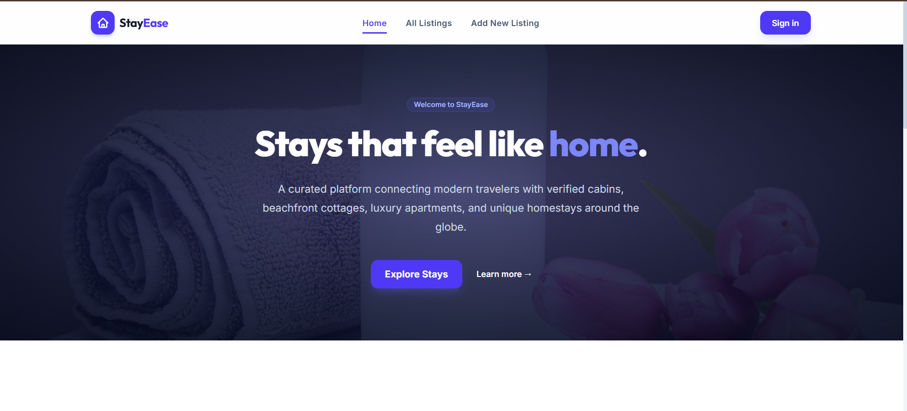
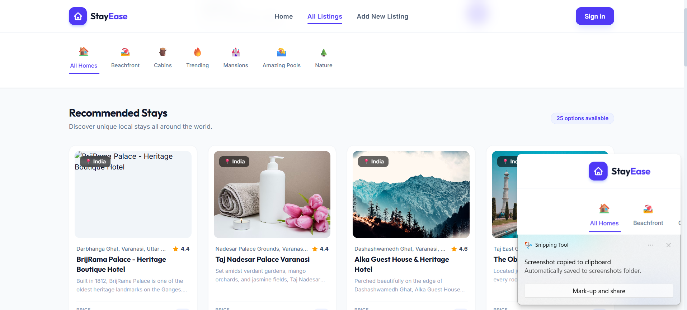
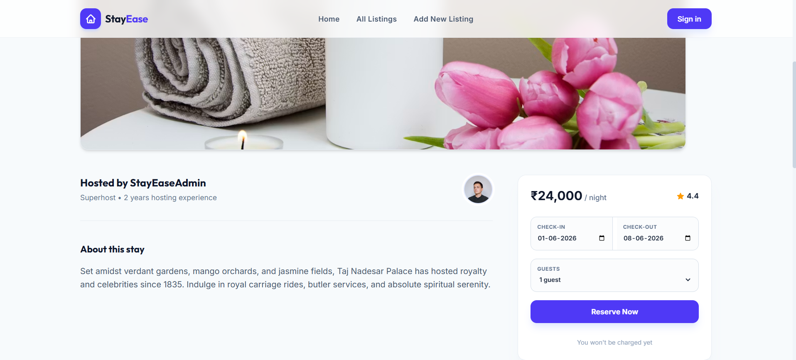
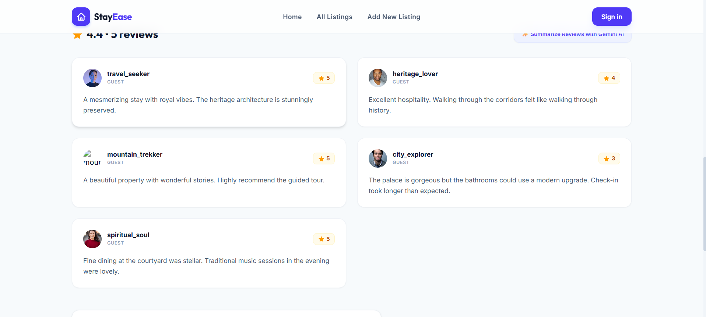
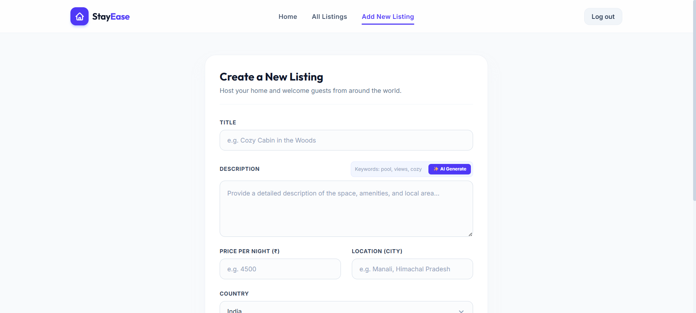

# 🏡 StayEase

**StayEase** is a full-stack, AI-powered accommodation booking platform that connects travelers with verified cabins, beachfront cottages, luxury apartments, and unique homestays across the globe. Built with a scalable architecture and containerized using Docker, the platform delivers a seamless booking experience with intelligent property recommendations, secure authentication, an integrated review system, and an interactive booking calendar.

🚀 **Live Demo:** https://stay-ease-pink-six.vercel.app

---

## ✨ Features

- 🏠 Browse verified accommodations worldwide
- 🔍 Smart search with advanced filtering
- 🤖 AI-powered property recommendations
- 📅 Interactive booking calendar
- ⭐ Review & rating system
- ❤️ Wishlist and saved properties
- 🔐 Secure authentication and authorization
- 👤 User profile management
- 🐳 Dockerized deployment
- 📱 Fully responsive across devices
- ⚡ Fast, scalable, and production-ready architecture

---

## 🛠️ Tech Stack

### Frontend
- React.js
- Tailwind CSS
- React Router
- Axios

### Backend
- Node.js
- Express.js

### Database
- MongoDB

### Authentication
- JWT Authentication

### AI
 Gemini API 

### DevOps
- Docker
- Docker Compose

---

## 📸 Screenshots

### 🏠 Home Page



---

### 🌍 Explore Properties



---

### 🏡 Property Details



---


### ⭐ Reviews & Ratings



---

### 👤 User Dashboard



---

## 📂 Project Structure

```text
StayEase/
│
├── backend/
├── frontend/
├── docker-compose.yaml
├── screenshots/
└── README.md
```

---

## 🤖 AI Features

- Intelligent property recommendations
- Personalized accommodation discovery
- Enhanced search experience based on user preferences

---

## 🌍 Project Vision

StayEase aims to simplify the accommodation booking experience by combining modern web technologies with AI. The platform enables users to discover unique stays, compare options, book with confidence, and share their experiences through reviews, all within a fast, secure, and intuitive interface.

---

## 🚀 Future Enhancements

- 💳 Online payment integration
- 💬 Real-time messaging between hosts and guests
- 🔔 Booking notifications
- 🌎 Multi-language support
- 📍 Interactive maps and nearby attractions
- 📈 Host analytics dashboard
- 🤖 AI travel assistant
- 📱 Progressive Web App (PWA)

---

## 👨‍💻 Author

**Sandeep Mishra**

- GitHub: https://github.com/spidy651
- LinkedIn: https://www.linkedin.com/in/sandeep-mishra-961206301

---

## ⭐ Support

If you like this project, consider giving it a ⭐ on GitHub!